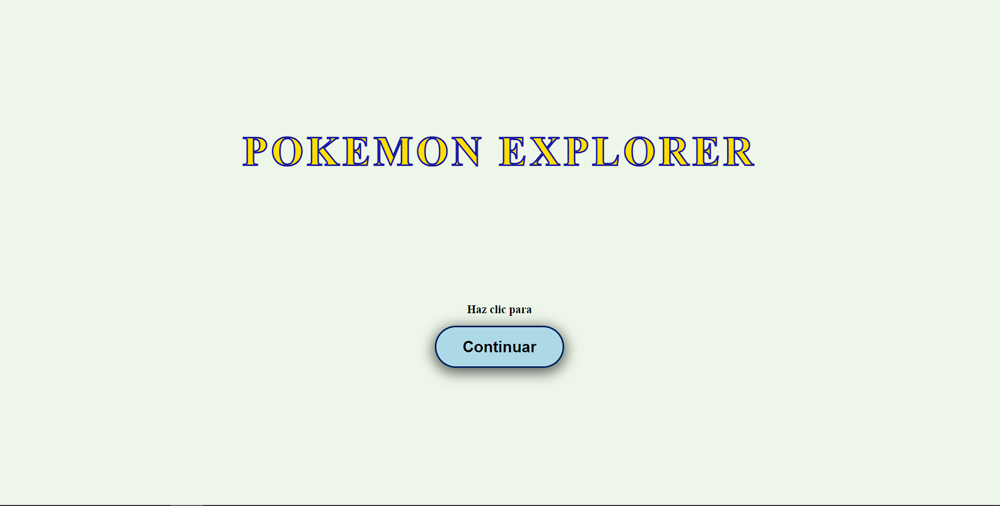
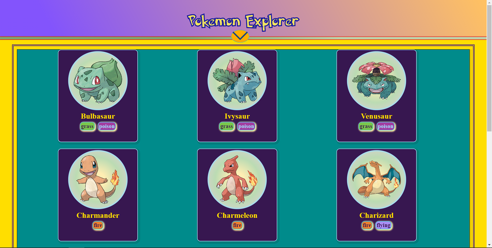
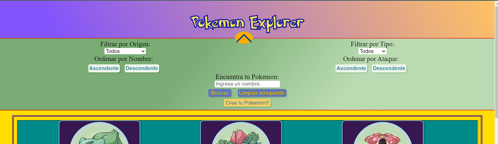
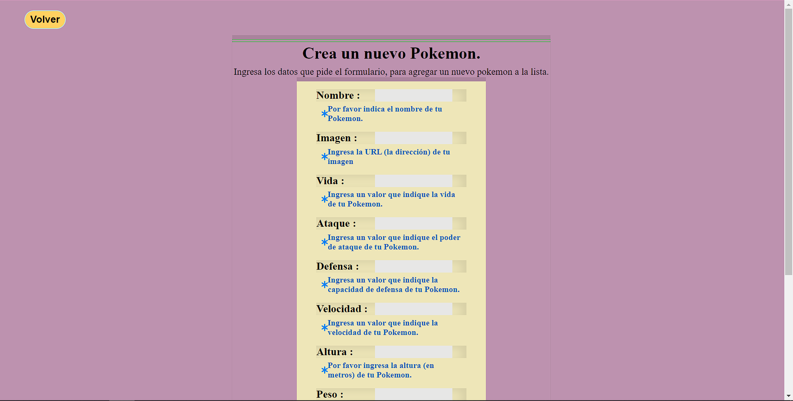
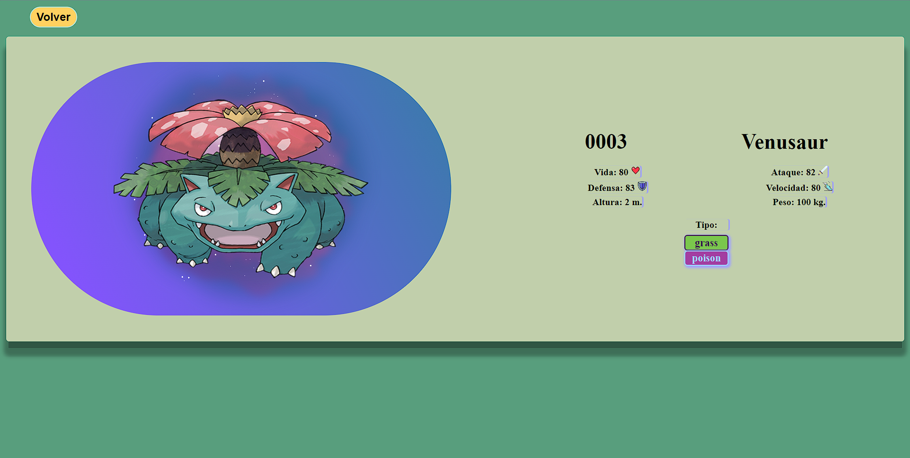
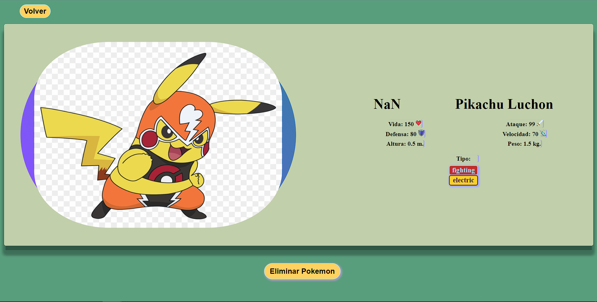

# PokeExplorer

## Descripción

Este proyecto es una aplicación desarrollada durante el bootcamp de Henry, con el propósito de poner en práctica los conocimientos teóricos adquiridos durante la cursada. La aplicación aprovecha los datos proporcionados por [PokeAPI - The RESTful Pokémon API](https://pokeapi.co/)
, y está construida utilizando una combinación de tecnologías como React, Redux y JavaScript para el desarrollo del frontend, mientras que para el backend se emplean Node.js y Express.

El frontend de la aplicación se desarrolló utilizando React, un framework de JavaScript ampliamente utilizado para la construcción de interfaces de usuario interactivas. Redux, por otro lado, se utilizó para gestionar el estado de la aplicación de manera eficiente, permitiendo un flujo de datos predecible y mantenible.

En cuanto al backend, se emplearon Node.js y Express para crear una API RESTful que maneja las solicitudes del cliente y gestiona la lógica del servidor. Node.js es un entorno de tiempo de ejecución de JavaScript que permite ejecutar código JavaScript fuera del navegador, mientras que Express es un framework de aplicaciones web para Node.js que simplifica el desarrollo de servidores web.

Además, se utilizó CSS para estilizar la interfaz de usuario y mejorar la experiencia del usuario en términos de diseño y presentación.

## Instalación

### Requisitos Previos
- Node.js instalado en tu sistema. Puedes descargarlo [aquí](https://nodejs.org/).

### Pasos de Instalación
1. Clona el repositorio desde GitHub:
   ```bash
   git clone https://github.com/Seb-RM/PI-H-PokeExplorer.git

  Si prefieres, también puedes descargar el código fuente como un archivo ZIP y descomprimirlo en tu computadora.

2. Accede al directorio del proyecto:
   ```bash
   cd pi-h-pokeexplorer

3. Cambia a la rama "master":
   ```bash
   git checkout master

4. Instala las dependencias del proyecto utilizando npm (Node Package Manager), en cada una de las carpetas principales "server" y "client":
   ```bash
   npm install
  Este comando instalará todas las dependencias necesarias que se encuentran en el archivo 'package.json'.

### Configuración del Entorno

Crea un archivo .env en la carpeta server y configura las variables de entorno necesarias, como las credenciales de la base de datos o las claves de API. Puedes encontrar un ejemplo de las variables necesarias en el archivo .env.example.

### Ejecución del Proyecto

Una vez completados los pasos anteriores, puedes ejecutar el proyecto localmente:

1. Para iniciar el servidor de desarrollo, abre la consola desde la carpeta server, y utiliza el siguiente comando:
   ```bash
   npm start
  Esto iniciará el servidor y la aplicación estará disponible en tu navegador en la dirección 'http://localhost:3001/'.

2. Para iniciar la app de react , abre la consola desde la carpeta client , y utiliza el siguiente comando:
   ```bash
   npm run dev

¡Listo! Ahora puedes comenzar a utilizar la aplicación y explorar sus funcionalidades.

## Uso

Para empezar a utilizar la aplicación, simpemente sigue estos pasos:

1. **Ingreso **: El ingreso a la aplicación es sencillo, simplemento se debe dar clic en el botón continuar.
   
    

2. **Explora Personajes**: Una vez en la aplicación puedes explorar las tarjetas de Pokémon. 

   
  
   La barra de herramientas te permite filtrar los Pokémon por tipo, ordenarlos según tu preferencia,y buscarlos por nombre. Además del filtrado por origen, que hace referencia al hecho de 
   que, además de visualizar los datos proporcionados por la API, puedes crear tu propio Pokémon para agregarlo a la lista. Solo tienes que usar el botón "Crea tu Pokémon!!" para acceder al 
   formulario de creación.
  
   

3. **Formulario de Creación**: Para crear un Pokémon solo tienes que seguir la indicaciones del formulario. No olvides de para la imagen debes ingresar una URL.

      

4. **Ver Detalles**: Una vez que hayas agregado tu Pokémon a la lista, puedes acceder a los detalles de sus datos haciendo clic en la tarjeta correspondiente. También puedes hacer lo mismo con el resto de las tarjetas.
   
   

   En el caso de un Pokémon creado por un usuario y guardado en la base de datos, al acceder a sus detalles también se verá un botón "Eliminar Pokémon", que  borrará sus datos de la misma.

   
